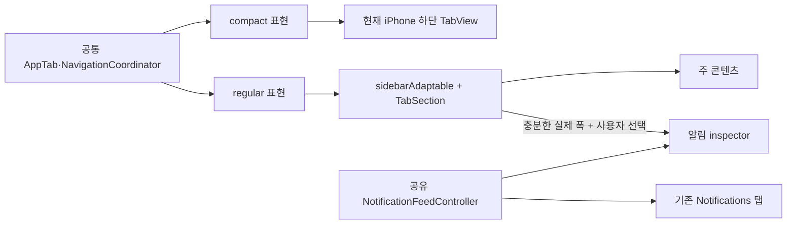

# HackersPub iPhone/iPad 적응형 레이아웃 분석 및 작업 계획

작성일: 2026-08-09

분석 기준:

- HackersPub: `b583491d648fa201103179d4a8abd195e8a2f9fe`
- Ice Cubes: `9c05a720597b3ff13de2e241bf58d3fba0863c09`
- 첨부 화면 5장: 모두 2136×1472
- 대상 플랫폼: iPhone과 iPad. Mac 지원은 비교 대상으로만 다루고 이번 작업 범위에서는 제외한다.

## 결론

HackersPub은 Ice Cubes의 화면을 그대로 복제할 필요가 없다. 이미 `ContentView`가 `TabView`의 `.sidebarAdaptable` 스타일과 사용자별 탭 커스터마이징을 사용하므로, iPhone 구조를 교체하지 않고도 iPad 정보 구조를 확장할 기반이 갖춰져 있다.

권장안은 다음 세 가지를 순서대로 적용하는 것이다.

1. iPhone의 탭 순서·역할·딥링크를 그대로 둔 채, iPad 사이드바에만 `TabSection` 기반 카테고리를 제공한다.
2. 충분히 넓은 iPad 창에서만 알림을 오른쪽 companion pane으로 열 수 있게 한다. 알림 탭은 없애거나 다른 의미로 바꾸지 않는다.
3. 오른쪽 pane이 닫힌 넓은 화면에서는 피드 본문의 최대 읽기 폭을 제한해 긴 행과 과도한 시선 이동을 줄인다.

오른쪽 알림 pane은 `NavigationSplitView`로 앱 전체를 재작성하기보다 SwiftUI `inspector`를 기존 `TabView`에 붙이는 방식이 가장 작고 적합하다. Apple은 inspector를 선택 항목의 속성뿐 아니라 주 콘텐츠를 보완하는 라이브러리 같은 영역에도 사용할 수 있다고 설명한다. regular 폭에서는 trailing column으로, compact 폭에서는 sheet로 적응하지만, HackersPub에서는 compact일 때 표시 요청을 비활성화해 기존 알림 탭 흐름을 유지해야 한다.

이번 계획은 모든 변경에 자동 회귀 테스트를 요구하지 않는다. 순수한 폭·표시 정책이나 중복 요청 방지처럼 실패 비용이 큰 상태 계약만 최소 자동화하고, 시스템 `TabView` 표현·폭·시각 밀도·멀티태스킹 전환은 실제 iPhone/iPad 수동 QA로 확인한다.

---

## 첨부 화면에서 확인한 Ice Cubes의 상호작용 모델

첨부 화면은 다음 다섯 상태를 보여준다.

| 화면 | 왼쪽 사이드바 | 오른쪽 알림 pane | 추가 UI | 관찰 결과 |
|---|---|---|---|---|
| 이미지 1 | 닫힘 | 열림 | 없음 | 주 피드와 알림을 동시에 확인한다. 주 콘텐츠 약 72%, 알림 약 28%로 보인다. |
| 이미지 2 | 닫힘 | 닫힘 | 없음 | 피드 행은 전체 폭을 쓰지만 본문과 행 액션 사이의 거리가 지나치게 길다. |
| 이미지 3 | 열림 | 닫힘 | 타임라인 메뉴 | 사이드바는 Timeline, Activities, Account, App으로 분류되고 현재 타임라인 명령은 제목 메뉴에 남는다. |
| 이미지 4 | 닫힘 | 열림 | 알림 필터 메뉴 | 오른쪽 pane 안에서 알림 종류를 바꾼다. 긴 메뉴가 pane을 상당 부분 덮는다. |
| 이미지 5 | 열림 | 닫힘 | 없음 | 전역 정보 구조와 현재 선택을 한눈에 파악할 수 있다. 주 피드는 여전히 매우 넓다. |

이미지만으로는 왼쪽과 오른쪽 pane의 동시 표시가 금지되는지 확인할 수 없다. 소스에서는 둘을 상호 배타적으로 만들지 않으므로, 충분한 폭에서는 동시에 표시될 수 있다.

가져올 가치가 큰 UX 원칙은 다음과 같다.

- 닫힌 사이드바는 간결한 상단 탭으로 바뀌고, 열린 사이드바는 설명형 카테고리를 제공한다.
- 알림을 보기 위해 현재 피드를 버리지 않아도 된다.
- pane 토글은 닫힌 상태에서는 주 콘텐츠 toolbar에, 열린 상태에서는 pane의 toolbar에 나타나 제어 대상이 분명하다.
- 왼쪽은 전역 목적지, 화면 제목 메뉴는 현재 피드의 필터·새로고침 같은 국소 명령을 맡는다.

개선이 필요한 부분도 분명하다.

- pane을 모두 닫으면 본문은 왼쪽, 시간과 더보기 버튼은 오른쪽 끝으로 갈라져 읽기 흐름이 나빠진다.
- 오른쪽 알림 pane은 전체 알림 탐색에는 좁고, 긴 필터 메뉴는 필터와 별도 목적지를 섞는다.
- 동일 목적지가 상단 탭, 사이드바, 제목 메뉴에 반복되면 각 UI의 책임이 모호해질 수 있다.
- 이미지로는 Dynamic Type, VoiceOver, 세로 방향, Split View, Stage Manager 동작을 검증할 수 없다.

---

## Ice Cubes 소스에서 확인한 실제 구현

### 1. 왼쪽 사이드바와 상단 탭

Ice Cubes의 상단 아이콘 탭은 커스텀 컨트롤이 아니다. [`AppView`](https://github.com/Dimillian/IceCubesApp/blob/9c05a720597b3ff13de2e241bf58d3fba0863c09/IceCubesApp/App/Main/AppView.swift#L39-L127)가 시스템 `TabView`에 `.sidebarAdaptable`을 적용하고, 각 `Tab`에 `.pinned` 또는 `.sidebarOnly` 배치를 지정한다.

[`SidebarSections`](https://github.com/Dimillian/IceCubesApp/blob/9c05a720597b3ff13de2e241bf58d3fba0863c09/IceCubesApp/App/Tabs/Tabs.swift#L314-L373)는 Timeline, Activities, Account, App 등의 그룹과 포함 탭을 정의한다. regular iPad/Mac에서는 이 섹션들을 공급하고, iPhone 또는 compact 환경에서는 사용자가 고른 5개 탭만 담은 단일 섹션을 공급한다.

중요한 점은 “같은 목적지 모델을 쓰되 창 환경에 따라 공급하는 정보 구조가 달라진다”는 것이다. iPhone용 화면을 별도로 구현하지 않는다.

### 2. 오른쪽 알림 pane

오른쪽 알림은 `NavigationSplitView`의 열이 아니다. [`AppView.body`](https://github.com/Dimillian/IceCubesApp/blob/9c05a720597b3ff13de2e241bf58d3fba0863c09/IceCubesApp/App/Main/AppView.swift#L39-L51)가 루트 `HStack`에 `NotificationsTab`을 한 번 더 붙인다. 조건은 다음과 같다.

- horizontal size class가 regular
- iPad 또는 Mac idiom
- 로그인 상태
- `showiPadSecondaryColumn` 설정이 `true`

보조 pane은 최대 폭 400pt이고, [전용 toolbar item](https://github.com/Dimillian/IceCubesApp/blob/9c05a720597b3ff13de2e241bf58d3fba0863c09/Packages/DesignSystem/Sources/DesignSystem/Views/StatusEditorToolbarItem.swift#L62-L80)이 `showiPadSecondaryColumn`을 토글한다. [설정 기본값](https://github.com/Dimillian/IceCubesApp/blob/9c05a720597b3ff13de2e241bf58d3fba0863c09/Packages/Env/Sources/Env/UserPreferences.swift#L43-L45)은 열림이다.

### 3. 그대로 가져오지 말아야 할 부분

| Ice Cubes 구현 | HackersPub에서 그대로 쓰면 생기는 문제 | 권장 대응 |
|---|---|---|
| `regular + pad/mac`만으로 오른쪽 pane 표시 | iPadOS의 자유 크기 창이나 Split View에서 주 콘텐츠 폭이 부족할 수 있다. | size class와 실제 컨테이너 폭을 함께 판단한다. |
| 오른쪽 pane 기본값 `true` | 기존 iPad 사용자의 화면이 업데이트 직후 크게 바뀐다. | 첫 도입은 기본 닫힘으로 하고 사용자가 연 선택만 기억한다. |
| `NotificationsTab`을 두 번 생성 | 주 알림 탭과 보조 pane이 별도 요청·필터·경로를 소유해 중복 작업이 가능하다. | 데이터 로딩 상태는 공유하고 표시 상태만 분리한다. |
| 의미가 불분명한 범용 Boolean으로 오른쪽 pane을 하드코딩 | 상태가 사용자 의도인지 실제 표시 상태인지 구분하기 어렵다. | 첫 구현은 `isNotificationsCompanionRequested`처럼 역할이 드러나는 Boolean 두 상태로 충분하다. 두 번째 pane 종류가 실제로 생길 때만 enum으로 확장한다. |
| compact에서 별도 정수 ID 기반 탭 설정 | HackersPub에 이미 더 안전한 `TabViewCustomization`과 안정적 문자열 ID가 있다. | 현재 커스터마이징 저장 구조를 유지한다. |
| 화면 외형 직접 모사 | OS 업데이트, 접근성, 포인터와 키보드 적응을 잃는다. | 시스템 `.sidebarAdaptable`, `TabSection`, `inspector` 외형을 사용한다. |

Ice Cubes는 AGPL-3.0으로 배포된다. 이 보고서는 공개 동작과 Apple API 사용 방식을 참고해 HackersPub 구조에 맞게 독립 구현하는 것을 전제로 한다. 소스 코드를 직접 복사할 필요도 없고 권장하지도 않는다.

---

## HackersPub의 현재 구조

### 이미 갖춘 기반

`HackersPub/Views/ContentView.swift`는 다음 기반을 이미 갖고 있다.

- 인증 사용자: Timeline, Notifications, News, Explore, Bookmarks, Search
- 게스트: Local, Fediverse, News, Search, Sign in
- `.tabViewStyle(.sidebarAdaptable)`
- `TabViewCustomization` 저장
- 인증/게스트별 커스터마이징 저장소 분리
- leaf 탭의 안정적인 `customizationID`
- Timeline/Local 필수 탭 고정
- Bookmarks의 tab bar 기본 숨김
- Search의 `.search` 역할

`HackersPub/HackersPubApp.swift`의 `NavigationCoordinator`는 탭별 `[NavigationDestination]`을 따로 보존한다. 딥링크는 뷰 계층을 직접 조작하지 않고 `currentTab`과 해당 탭의 path를 바꾸므로, 루트 `TabView`를 유지하면 기존 딥링크 설계를 재작성할 필요가 없다.

`NotificationReadState`는 unread badge와 읽음 처리를 앱 전역에서 공유한다. 반면 `NotificationsView`의 목록, pagination, 로딩, 오류, 스크롤 상태는 뷰 로컬이다.

### 현재 공백

| 영역 | 현재 상태 | 필요한 변화 |
|---|---|---|
| iPad 정보 구조 | 모든 탭이 평면 | regular 환경에서만 의미 있는 `TabSection` 제공 |
| 오른쪽 pane | 없음 | 넓은 iPad에서 선택적으로 표시하는 알림 companion |
| 실제 폭 정책 | 없음 | pane 최소 폭과 주 콘텐츠 최소 폭을 합산한 eligibility 정책 |
| 알림 데이터 소유권 | `NotificationsView` 로컬 | primary 탭과 companion이 공유할 controller |
| 알림 pane 라우팅 | 전용 계약 없음 | 알림 선택 시 주 콘텐츠에 상세를 여는 명시적 동작 |
| 넓은 피드 가독성 | `LazyVStack`이 가로 제한 없이 확장 | 넓은 단일 pane에서만 읽기 폭 제한 |
| Mac | 앱 타깃에서 Catalyst 비활성화 | 이번 범위에서 제외 |

앱 타깃은 iOS 26.0, `TARGETED_DEVICE_FAMILY = "1,2"`, `SUPPORTED_PLATFORMS = "iphoneos iphonesimulator"`, `SUPPORTS_MACCATALYST = NO`다. 테스트 타깃의 macOS/xrOS 설정은 앱의 플랫폼 지원 근거가 아니다.

---

## 권장 적응형 구조

핵심은 목적지와 표현을 분리하는 것이다.

- `AppTab`과 `NavigationCoordinator`는 공통이다.
- compact에서는 현재 iPhone 탭 구성을 그대로 렌더링한다.
- regular에서는 같은 leaf 탭을 카테고리로 묶는다.
- 알림 inspector는 탭을 대체하지 않는다.
- primary Notifications 탭이 선택되면 중복 표시를 피하기 위해 inspector만 일시적으로 숨긴다. 사용자가 열어 둔 선호 자체는 지우지 않는다.

### 권장 사이드바 정보 구조

compact 탭 순서를 바꾸지 않기 위해 compact와 regular의 선언 구조를 분리하되, 실제 목적지 content builder와 leaf ID는 공유한다.

인증 사용자 regular sidebar:

| 섹션 | 목적지 | tab bar 기본 노출 |
|---|---|---|
| Browse | Timeline, News, Explore, Search | 현재 iPhone에서 보이는 핵심 항목을 유지 |
| Personal | Notifications, Bookmarks | Notifications는 노출, Bookmarks는 현재처럼 기본 숨김 |

게스트 regular sidebar:

| 섹션 | 목적지 | tab bar 기본 노출 |
|---|---|---|
| Browse | Local, Fediverse, News, Search | 현재 순서와 노출 유지 |
| Account | Sign in | 현재 노출 유지 |

섹션명은 영어·한국어 현지화를 추가한다. leaf의 `timeline`, `notifications`, `news`, `explore`, `bookmarks`, `search`, `local`, `global`, `signIn` ID는 바꾸지 않는다.

### 권장 pane 폭 정책

기기 이름이 아니라 현재 컨테이너가 실제로 감당할 수 있는 폭을 사용한다.

| 모드 | 조건 | 표현 |
|---|---|---|
| Compact | compact size class 또는 실제 폭 부족 | 현재 단일 탭 화면. 알림 inspector 토글도 숨김 |
| Regular single | regular지만 주 콘텐츠+pane 최소 폭 미충족 | iPad 상단 탭/사이드바는 사용 가능, 오른쪽 pane은 숨김 |
| Regular companion | regular, 인증, 실제 폭 충분, 사용자가 열기를 선택, primary가 Notifications가 아님 | 주 콘텐츠 + 오른쪽 알림 inspector |

초기 폭 예산은 다음 범위에서 실제 기기로 조정한다.

- 주 콘텐츠 최소: 600–680pt
- 알림 pane 최소/이상/최대: 320/380/420pt
- divider와 safe-area 여유를 포함해 전체 임계값을 계산한다.

고정된 “iPad이면 열기” 조건은 사용하지 않는다. 창이 줄어들어 pane을 숨길 때도 사용자가 명시적으로 열어 둔 선호는 유지하고, 다시 충분히 넓어졌을 때 복원한다.

### 오른쪽 알림의 역할

오른쪽 pane은 “작은 Notifications 탭”이 아니라 현재 작업을 유지하면서 알림을 훑는 companion이다.

- 목록과 unread 상태는 primary Notifications 탭과 공유한다.
- pane 자체 스크롤 위치는 독립적으로 보존할 수 있다.
- 알림의 프로필이나 게시물을 선택하면 현재 주 탭의 `NavigationStack`에 상세를 연다.
- 더 깊은 알림 탐색이 필요하면 기존 Notifications 탭으로 이동할 수 있는 명확한 동작을 제공한다.
- primary Notifications 탭이 선택된 동안은 companion을 숨겨 같은 목록을 양쪽에 중복 표시하지 않는다.

현재 GraphQL `NotificationsQuery`에는 notification type 필터 인자가 없다. Ice Cubes 화면의 종류별 필터를 현재 로드된 20개 항목에만 클라이언트 필터로 적용하면 pagination 전체 결과와 일치하지 않는다. 따라서 종류별 필터는 이번 범위에서 제외한다. 서버가 필터 계약을 제공하거나 전체 데이터에 정확히 적용할 방법이 생긴 뒤 별도 작업으로 다룬다.

### 넓은 피드의 읽기 폭

오른쪽 pane이 닫힌 전체 화면에서 피드 행을 단순히 끝까지 늘리지 않는다.

- 스크롤 배경은 전체 폭을 유지한다.
- 본문 열은 넓은 regular 환경에서만 중앙 정렬하고 최대 폭을 둔다.
- 본문 텍스트는 약 680–760pt, 미디어는 약 800–900pt 범위를 시작점으로 실제 콘텐츠에서 조정한다.
- 시간·더보기 같은 행 액션은 본문 열 가까이에 둔다.
- iPhone과 좁은 iPad에는 최대 폭 정책을 적용하지 않는다.

---

## iPhone 사용성을 보존하는 규칙

1. iPhone의 탭 순서, 기본 탭, 탭 제목, badge, Search 역할을 바꾸지 않는다.
2. iPad용 목적지를 iPhone 탭 바에 추가하지 않는다.
3. 알림 companion은 compact에서 sheet로 자동 변환해 띄우지 않는다. compact에서는 기존 Notifications 탭만 사용한다.
4. 탭별 `NavigationCoordinator` path와 딥링크 목적지는 유지한다.
5. iPad 전용 max-width와 padding은 compact 환경에 적용하지 않는다.
6. popover에 적합한 동작도 compact에서는 기존 menu/sheet 흐름을 유지한다.
7. 창 폭 변화는 표현만 바꾸고 현재 탭, 피드 상태, navigation path를 초기화하지 않는다.
8. 인증 상태가 바뀌면 현재 `AppTabSelectionPolicy`로 유효한 탭만 보정하고, companion이 로그인 전 콘텐츠를 남기지 않게 한다.

Apple도 iPhone과 iPad의 탭을 일관되게 유지하고 탭 수를 과도하게 늘리지 말라고 권고한다. sidebar는 iPad에서 더 많은 계층을 드러내는 보조 표현이어야지, iPhone의 핵심 탐색 구조를 다른 제품으로 바꾸는 이유가 되어서는 안 된다.

---

## 상세 작업 계획

### 1단계. 탭 메타데이터와 regular sidebar 카테고리

목표: 동작을 바꾸지 않고 iPad에서 탭을 카테고리로 탐색할 수 있게 한다.

대상 파일:

- `HackersPub/Views/ContentView.swift`
- `HackersPub/HackersPubApp.swift` — 필요할 때만 `AppTab`의 표시 메타데이터 추가
- `HackersPub/en.lproj/Localizable.strings`
- `HackersPub/ko.lproj/Localizable.strings`

작업:

1. compact 탭 순서와 regular sidebar section 목록을 별도 데이터로 정의한다.
2. leaf 탭 content 생성은 한 곳에서 공유해 두 표현에서 화면 구현이 갈라지지 않게 한다.
3. regular에서 `TabSection`을 사용하고, 핵심 탭은 기존 tab bar 위치를 유지한다.
4. 기존 leaf `customizationID`와 guest/authenticated 저장 키는 유지한다.
5. 현재 필수 탭 고정과 Bookmarks 기본 숨김 정책을 보존한다.
6. regular↔compact 전환 때 현재 선택이 새 목록에 없으면 기존 `AppTabSelectionPolicy`로만 보정한다.

완료 조건:

- iPhone에서 탭 순서와 기본 동작이 현재와 같다.
- iPad에서 sidebar를 열면 Browse, Personal 또는 Account 카테고리가 보인다.
- sidebar를 닫으면 시스템 상단 tab bar로 자연스럽게 돌아간다.
- 기존 탭 커스터마이징 데이터를 불필요하게 초기화하지 않는다.

자동 테스트: 새 테스트를 기본 요구하지 않는다. 저장 포맷을 실제로 변경하게 될 때만 기존 `TabCustomizationPersistenceCoordinatorTests`에 호환성 사례를 최소 추가한다. 시스템 `TabSection` 렌더링은 테스트하지 않는다.

### 2단계. 알림 데이터와 presentation 분리

목표: primary Notifications 탭과 companion이 같은 목록 상태를 안전하게 공유하게 한다.

대상 파일:

- `HackersPub/Views/NotificationsView.swift`
- `HackersPub/Views/NotificationFeedContent.swift`
- 신규 `HackersPub/Views/NotificationFeedController.swift`
- 필요 시 `HackersPub/Views/NotificationRowView.swift`

작업:

1. `NotificationsView`에 있는 목록·세션·pagination·retry 상태를 `@MainActor @Observable` controller로 옮긴다.
2. 앱 루트 또는 `ContentView`가 controller를 한 번 소유하고 두 presentation에 전달한다.
3. primary presentation은 현재 `.notifications` path, toolbar, 설정 접근을 유지한다.
4. companion presentation은 중복 profile/settings toolbar를 제거하고, 알림 선택을 현재 주 콘텐츠 route로 전달한다.
5. pane을 열거나 레이아웃이 바뀐 것만으로 초기 fetch와 읽음 처리가 중복되지 않게 한다.

완료 조건:

- primary와 companion이 같은 items, error, loading, unread 결과를 본다.
- companion 표시만으로 중복 초기 요청을 만들지 않는다.
- companion에서 항목을 열어도 primary tab selection은 불필요하게 Notifications로 바뀌지 않는다.

자동 테스트: 기존 `NotificationFeedStateTests`와 `NotificationReadStateTests`가 이미 pagination, 경합, 실패, badge를 충분히 다룬다. controller 추출이 새로운 single-flight 계약을 만들 때만 그 계약 한두 개를 추가한다. 기존 로직을 다시 전부 테스트하지 않는다.

### 3단계. 폭 기반 알림 inspector

목표: 넓은 iPad에서 현재 피드를 유지한 채 알림을 열고 닫게 한다.

대상 파일:

- `HackersPub/Views/ContentView.swift`
- 신규 `HackersPub/Views/AdaptiveAppLayoutPolicy.swift`
- `ContentView` 내부의 알림 companion 요청 상태
- `HackersPub/en.lproj/Localizable.strings`
- `HackersPub/ko.lproj/Localizable.strings`

작업:

1. `horizontalSizeClass`, 실제 컨테이너 폭, 인증 상태, 현재 탭, 사용자 표시 의도를 입력받는 순수 layout policy를 만든다.
2. 기존 `TabView`에 `inspector(isPresented:)`를 연결한다.
3. inspector 폭은 min/ideal/max 범위로 지정한다.
4. 닫힌 상태의 toggle은 주 콘텐츠 toolbar, 열린 상태의 close toggle은 inspector toolbar에 둔다.
5. compact 또는 폭 부족 상태에서는 실제 presentation만 숨기고 사용자 의도는 지우지 않는다.
6. primary Notifications 탭에서는 inspector를 일시 숨긴다.
7. 첫 릴리스 기본값은 닫힘으로 둔다.

완료 조건:

- iPhone과 compact iPad에는 inspector toggle이나 자동 sheet가 나타나지 않는다.
- 넓은 iPad에서 toggle로 알림 pane을 열고 닫을 수 있다.
- pane을 열어도 주 탭과 navigation path, 피드 위치가 유지된다.
- 창을 줄이면 companion이 먼저 사라지고, 다시 넓히면 사용자가 열어 둔 의도에 따라 복원된다.

자동 테스트: `AdaptiveAppLayoutPolicyTests` 한 파일만 권장한다. compact 미표시, 폭 부족 미표시, 사용자가 닫은 상태 유지, Notifications 탭에서 중복 미표시 같은 순수 규칙만 검증한다. `inspector` 자체나 toolbar 위치는 자동 테스트하지 않는다.

### 4단계. 넓은 화면 피드 가독성

목표: pane을 닫은 iPad에서도 긴 행과 빈 공간 문제를 줄인다.

대상 파일:

- `HackersPub/Views/TimelineFeedPresentation.swift`
- `HackersPub/Views/NotificationFeedContent.swift`
- 필요 시 신규 `HackersPub/Views/ReadableFeedColumn.swift`

작업:

1. regular의 넓은 컨테이너에서만 본문 열 최대 폭을 적용한다.
2. divider와 배경을 어디까지 유지할지 Timeline과 Notifications에서 동일한 원칙을 사용한다.
3. Dynamic Type가 클 때 고정 폭이 내용 잘림을 만들지 않게 최대 폭만 제한하고 최소 폭은 강제하지 않는다.
4. 미디어의 최대 폭은 텍스트보다 넓게 둘 수 있게 분리한다.

완료 조건:

- 넓은 iPad에서 본문과 행 액션의 시선 거리가 줄어든다.
- iPhone 레이아웃과 터치 영역은 변하지 않는다.
- pane을 열고 닫아도 콘텐츠가 갑자기 과도하게 확대·축소되지 않는다.

자동 테스트: 없음. 이 단계는 실제 iPhone/iPad와 Dynamic Type에서 수동 시각 QA로 판단한다. snapshot 체계는 이 작업만을 위해 도입하지 않는다.

### 5단계. 실제 기기 QA와 출시 판단

필수 수동 시나리오:

- iPhone 세로/가로: 현재 탭, 검색, 작성, 알림 badge, 딥링크
- iPad 세로/가로: sidebar 열림/닫힘, companion 열림/닫힘
- iPad 자유 크기 창: 1/2, 1/3, 2/3, 사분면, 최소 폭, 전체 화면
- regular→compact→regular: 현재 탭, 상세 path, 피드 위치, companion 의도
- 인증→로그아웃→재로그인: guest/auth 탭 구성과 알림 데이터 격리
- Dynamic Type 큰 크기, VoiceOver 초점 순서, 키보드와 포인터

한 번의 QA 흐름으로 다음을 함께 확인하면 된다.

1. Timeline에서 게시물 상세를 열고 피드 위치를 만든다.
2. 알림 companion을 열고 한 항목을 선택한다.
3. 창 폭과 방향을 여러 단계로 바꾼다.
4. 다시 원래 폭으로 돌아왔을 때 주 콘텐츠와 companion 상태를 확인한다.
5. Notifications 탭을 선택해 중복 pane이 사라지는지 확인한다.
6. 로그아웃해 이전 계정 알림이 남지 않는지 확인한다.

이 작업을 위해 모든 화면의 UI 자동화나 snapshot을 추가하지 않는다. 실제 멀티태스킹 창 조절은 XCTest로 안정적으로 재현하기 어렵고, 시스템 UI의 픽셀 결과를 고정하는 테스트는 유지비가 크다.

---

## 작업 단위와 권장 배포 순서

| 순서 | 배포 단위 | 사용자 가치 | 위험 | 독립 출시 가능 여부 |
|---:|---|---|---|---|
| 1 | iPad sidebar 카테고리 | 목적지 발견과 전환 개선 | 낮음 | 가능 |
| 2 | 알림 controller 분리 | companion 준비, 중복 상태 방지 | 중간 | 사용자 변화 없이 가능 |
| 3 | 폭 기반 알림 inspector | 피드와 알림 병렬 사용 | 중간 | 가능 |
| 4 | 피드 읽기 폭 조정 | 넓은 화면 가독성 개선 | 낮음~중간 | 가능 |
| 5 | 알림 종류 필터 | 세밀한 알림 탐색 | 서버 계약 필요 | 이번 범위 제외 |
| 6 | Mac Catalyst | Mac 전용 창·메뉴·toolbar | 높음 | 별도 프로젝트로 분리 |

한 번에 모두 묶지 않는 편이 좋다. 1단계만으로도 iPad 정보 구조가 개선되고, 2단계는 사용자 UI를 바꾸지 않은 채 3단계의 상태 위험을 줄인다. 4단계는 실제 iPad에서 3단계의 폭을 확인한 뒤 수치를 조정할 수 있다.

---

## 주요 위험과 대응

| 위험 | 발생 원인 | 대응 |
|---|---|---|
| iPhone 탭 순서 변화 | regular section 선언을 compact에도 그대로 사용 | compact 순서를 별도로 유지하고 content/ID만 공유 |
| 크기 변경 시 화면 초기화 | 서로 다른 탭 트리를 조건부로 완전히 재생성 | controller와 navigation path를 shell 밖에서 소유하고 stable leaf ID 유지 |
| 알림 중복 요청 | primary와 companion이 각각 로딩 상태 소유 | 공유 controller와 표시 시점 명시 |
| 읽음 처리 과다 | 보이지 않는 companion도 visible로 간주 | 실제 presentation visibility를 읽음 처리 입력으로 전달 |
| 같은 알림 양쪽 표시 | Notifications 탭과 companion 동시 노출 | primary Notifications 선택 시 companion만 일시 숨김 |
| 창이 좁은데 pane 유지 | size class만 확인 | 실제 폭 예산을 함께 계산 |
| 기존 커스터마이징 손실 | leaf ID 또는 저장 키 변경 | 기존 ID/키 유지, 구조 변경이 필요한 경우에만 migration 검토 |
| 부정확한 알림 필터 | 현재 페이지에만 클라이언트 필터 적용 | 서버 필터 계약 전까지 제외 |
| 과도한 테스트 유지비 | 시스템 UI의 모든 조합을 자동화 | 순수 핵심 정책만 자동화하고 레이아웃은 실제 기기 QA |

---

## 완료 정의

다음 조건을 모두 만족하면 1차 iPad 개선을 완료한 것으로 본다.

- iPhone의 핵심 탭 구조, 작성, 검색, 알림, 딥링크 사용성이 기존과 같다.
- iPad에서 sidebar를 열어 카테고리별 목적지를 찾을 수 있다.
- 넓은 iPad에서 알림 companion을 명시적으로 열고 닫을 수 있다.
- companion은 compact에서 나타나지 않고 Notifications 탭을 대체하지 않는다.
- 창 폭 변화가 현재 탭과 주 navigation path를 잃게 하지 않는다.
- primary와 companion이 알림 목록·읽음 결과를 일관되게 공유한다.
- 넓은 단일 pane의 피드 본문이 읽기 적절한 폭을 유지한다.
- 모든 사소한 UI에 회귀 테스트를 추가하지 않고, 핵심 policy와 새로운 상태 계약만 필요한 만큼 검증한다.

---

## 범위 밖과 후속 후보

이번 작업에서 제외한다.

- Ice Cubes의 알림 종류 필터 전체 복제
- Direct Messages를 알림 필터 메뉴에 섞는 구성
- 동적 Lists, Tag Groups, Local Timelines 기능 추가
- 공통 navigation destination switch의 전면 리팩터링
- `selectedTab: String`을 `AppTab`으로 바꾸는 별도 타입 리팩터링
- Mac Catalyst 또는 네이티브 macOS 타깃
- iPad 전용 분석 이벤트 체계
- 새 snapshot 프레임워크 도입

향후 companion이 알림 외에도 스레드, 프로필, 링크 정보로 확장될 실제 요구가 생기면 그때 `AuxiliaryPaneDestination` 같은 다중 목적지 타입, 독립 path, 사용자가 pane 종류를 바꾸는 UI를 설계한다. 첫 구현에서 미래 가능성을 이유로 범용 pane 프레임워크를 만들지는 않는다.

---

## 근거 자료

Apple 공식 자료:

- [WWDC24: Elevate your tab and sidebar experience in iPadOS](https://developer.apple.com/videos/play/wwdc2024/10147/)
- [SwiftUI: sidebarAdaptable](https://developer.apple.com/documentation/swiftui/tabviewstyle/sidebaradaptable)
- [SwiftUI: TabSection](https://developer.apple.com/documentation/swiftui/tabsection)
- [SwiftUI: TabViewCustomization](https://developer.apple.com/documentation/swiftui/tabviewcustomization)
- [SwiftUI: inspector](https://developer.apple.com/documentation/swiftui/view/inspector(isPresented:content:))
- [HIG: Sidebars](https://developer.apple.com/design/human-interface-guidelines/sidebars)
- [HIG: Split views](https://developer.apple.com/design/human-interface-guidelines/split-views)
- [HIG: Layout](https://developer.apple.com/design/human-interface-guidelines/layout)
- [HIG: Windows](https://developer.apple.com/design/human-interface-guidelines/windows)

Ice Cubes:

- [Repository](https://github.com/Dimillian/IceCubesApp)
- [AppView at analyzed commit](https://github.com/Dimillian/IceCubesApp/blob/9c05a720597b3ff13de2e241bf58d3fba0863c09/IceCubesApp/App/Main/AppView.swift)
- [Tabs and SidebarSections at analyzed commit](https://github.com/Dimillian/IceCubesApp/blob/9c05a720597b3ff13de2e241bf58d3fba0863c09/IceCubesApp/App/Tabs/Tabs.swift)
- [AGPL-3.0 license at analyzed commit](https://github.com/Dimillian/IceCubesApp/blob/9c05a720597b3ff13de2e241bf58d3fba0863c09/LICENSE)
